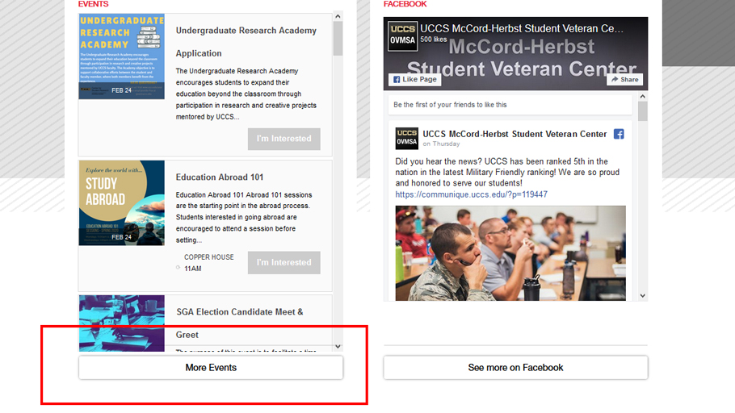
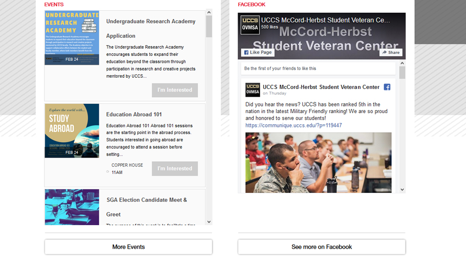
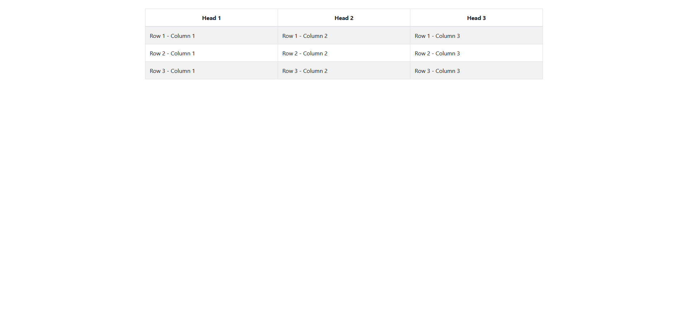

# CSS Fixes and Modifications
<details>
 <summary>Content Card Overflow Fix</summary>

## [Content-Card-Container-Overflow-Fix.css](https://github.com/mwesker/code-bits/blob/master/CSS/content-card-container-overflow-fix.css "content-card-container-overflow-fix.css")

```css
.uccs-cta-card-content {
	height:calc(100% + 5em);
}
```
## Before Fix


## After Fix


</details>

<details>

<summary>Link Helper Style for Migrations</summary>

## [highlight-old-links.html](https://github.com/mwesker/code-bits/blob/master/CSS/Migration-Helpers/highlight-old-links.html "highlight-old-links.html")

```css
a[href^="/<replace>"], a[href*="edu/<replace>/"] {
	border: 3px red dashed !important;
}

a[href^="/<replace>"]::before, a[href*="edu/<replace>/"]::before {
	content:"*";
}

a[href*="/<replace>/sites/<replace>/"], img[src*="/<replace>/sites/<replace>/"] {
	border: 3px red dashed !important;
}
```
### Example


</details>

<details>

<summary>Responsive Table #1</summary>

## [responsive-table-one.css]("#")

```css
/*Todo*/
```
### Example

[](./Images/responsive-table-full-res.jpg)]
[](./Images/responsive-table-first-break.jpg)]
[](./Images/responsive-table-final-break.jpg)]


</details>
