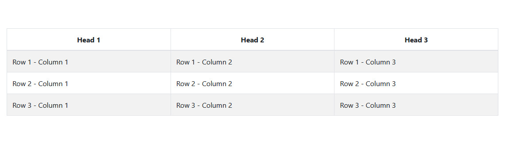
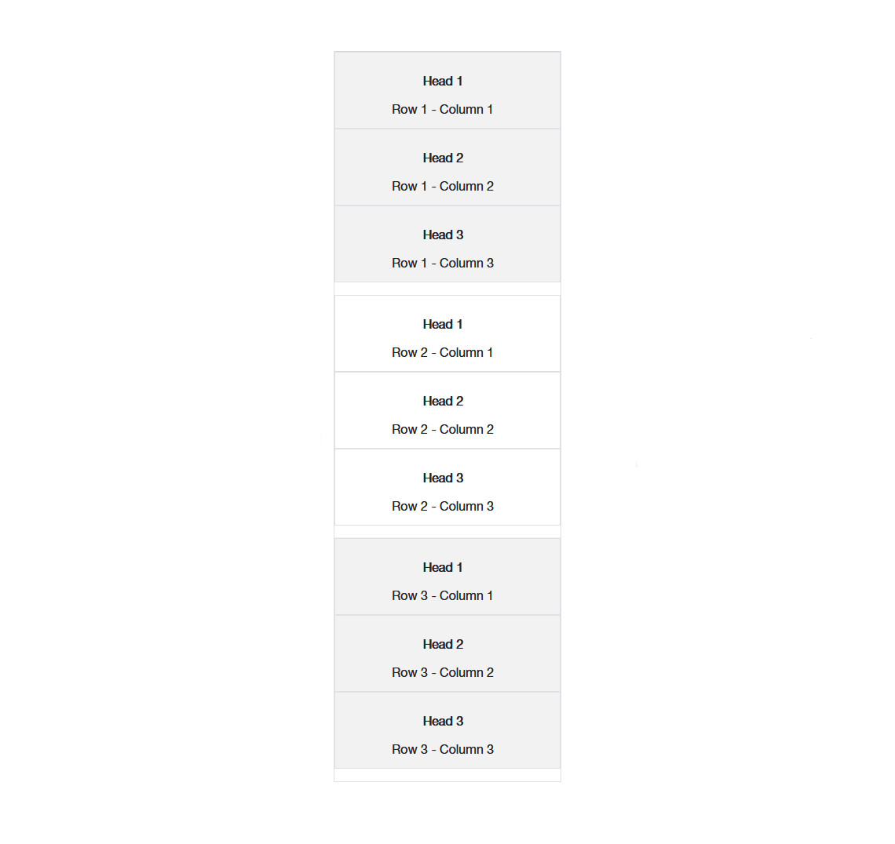

# CSS Fixes and Modifications
<details>
 <summary>Content Card Overflow Fix</summary>

## [Content-Card-Container-Overflow-Fix.css](https://github.com/mwesker/code-bits/blob/master/CSS/content-card-container-overflow-fix.css "content-card-container-overflow-fix.css")

```css
.uccs-cta-card-content {
	height:calc(100% + 5em);
}
```
## Before Fix


## After Fix


</details>

<details>

<summary>Link Helper Style for Migrations</summary>

## [highlight-old-links.html](https://github.com/mwesker/code-bits/blob/master/CSS/Migration-Helpers/highlight-old-links.html "highlight-old-links.html")

```css
a[href^="/<replace>"], a[href*="edu/<replace>/"] {
	border: 3px red dashed !important;
}

a[href^="/<replace>"]::before, a[href*="edu/<replace>/"]::before {
	content:"*";
}

a[href*="/<replace>/sites/<replace>/"], img[src*="/<replace>/sites/<replace>/"] {
	border: 3px red dashed !important;
}
```
### Example


</details>

<details>

<summary>Responsive Table #1</summary>

## [responsive-table-one.css](https://github.com/mwesker/code-bits/blob/master/CSS/responsive-table-one.css "responsive-table-one.css")

```css
/*Tables must use thead for the headers. Works only with relatively simple tables*/


/*Add or change the :before selectors with the text for each corresponding header*/
/*If there are multiple tables use id selectors with the td:nth-of-type(n):before rules
Ex. #table1 td:nth-of-type(n):before rules {...}
*/
@media screen
and (max-width: 760px), (min-device-width: 768px)
and (max-device-width: 1024px)  {

    td:nth-of-type(1):before {
        content: "Head 1";
    }
    td:nth-of-type(2):before {
        content: "Head 2";
    }
    td:nth-of-type(3):before {
        content: "Head 3";
    }
    /*Add more as needed*/
    /* #id optional
    #id td:nth-of-type(n):before {
        content: "Head n";
    }
     */
}

/*Depending on the needs of your table you may need to adjust the following style*/
@media only screen
and (max-width: 760px), (min-device-width: 768px)
and (max-device-width: 1024px)  {

    table, thead, tbody, th, td, tr {
        display: block;
    }

    thead tr {
        position: absolute;
        top: -9999px;
        left: -9999px;
    }
    tr {
        margin: 0 0 1rem 0;
    }

    tr:nth-child(odd) {
        background: #ccc;
    }

    td {
        border: none;
        border-bottom: 1px solid #eee;
        position: relative;
        padding-left: 50% !important;
        text-align:center;
        width: auto !important;
    }

    td:before {
        position: absolute;
        top: 0;
        left: 6px;
        width: 45%;
        padding-right: 10px;
        white-space: nowrap;
        padding: .75rem;
        font-weight:bold;
    }

}

@media only screen
and (max-width: 552px){
    td:before {
        position: relative;
        left: 0px;
        white-space: normal;
        word-break: break-all;
        width: 100%;
        display: inline-block;
    }
    .table td,
    .table th {
        padding-left:0 !important;
        width: auto !important;
    }
}

.table thead th {
    text-align:center;
}
```
### Example

#### No Break - Width > 1024px


---

#### First Break - 1024px >= Width > 552px


---

#### Final Break - 552px >= Width



</details>
